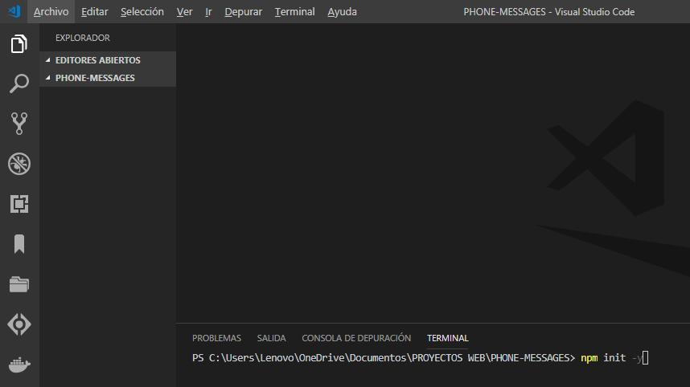
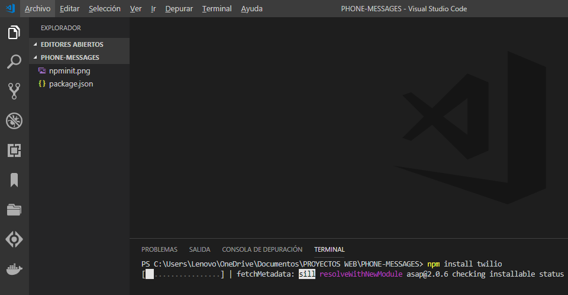

# Text-message-on-cell-phone-with-Node.js
Send text messages to mobile user devices using Twilio as a Web Service.

# 1 enter the following command in your console

a package.json is created

`$ npm init -y`

# 2 Install twilio
> Library that Twilio offers us to use their services, we will use the text messaging service.
> Enter the following command in your console:

`$ npm install twilio`

>To be able to use it we must register on their website

>Enter the following link :arrow_right:  https://www.twilio.com/

