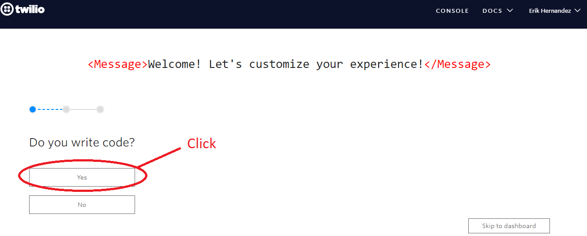
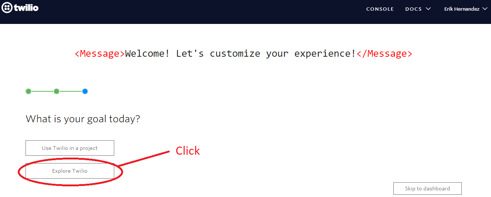
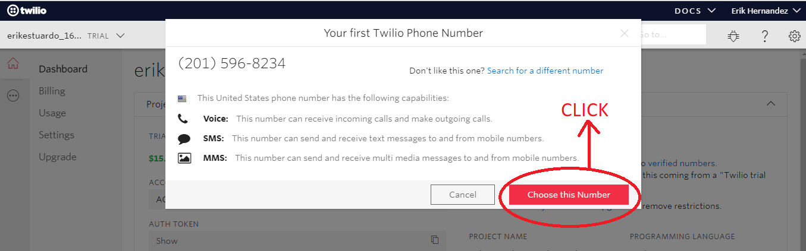

# Text-message-on-cell-phone-with-Node.js
:star2: Send text messages to mobile user devices using Twilio as a Web Service.

# 1 enter the following command in your console

a package.json is created

`$ npm init -y`

# 2 Install twilio
> Library that Twilio offers us to use their services, we will use the text messaging service.
> Enter the following command in your console:

`$ npm install twilio`

# 2 Register on your page
>In order to use it, we must register on your website and add your phone number to be able to send messages

>Enter the following link :arrow_right:  https://www.twilio.com/

# 3 Welcome message
> click on the button Yes to enter code

# 4 Select the option
> click on the option Node.js, this is the one that we are going to use

# 5 What is your goal
> How are we learning to click on the explore button

# 6 Choose service
> Twilio has several services, we chose the option to send and receive sms

### You will already have access to your control panel

# 7 click on button get a free number

### Results in the following pop-up window

>You get a number where you can send and receive text messages to a phone.

>click on button to choose this number.

